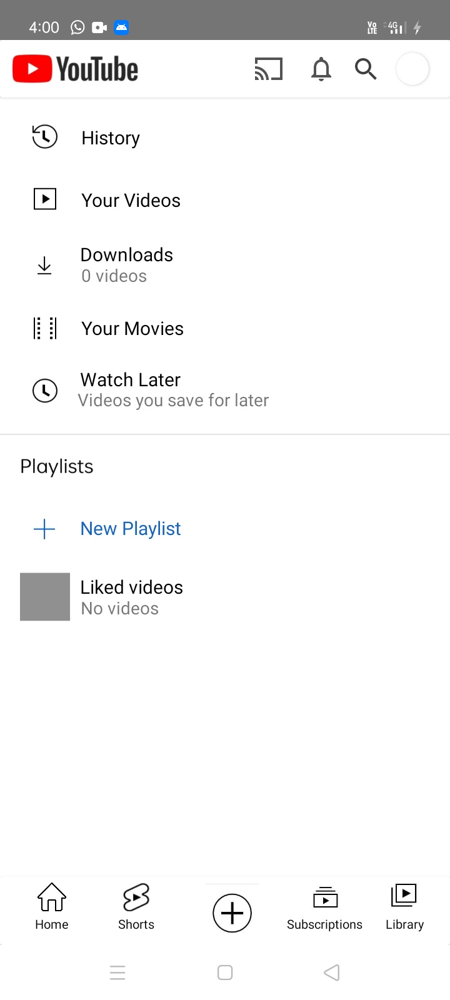

# Streamhive Android App  

## Description  
**Streamhive** is an Android application that provides a seamless video-sharing and streaming experience. It offers features like video streaming, short videos, and subscription to content channels, aiming to deliver a modern, interactive user interface and an engaging platform for users.  

---

## Features  
- **Home Screen**: Displays videos in a dynamic RecyclerView with intuitive navigation.  
- **Short Videos**: Vertical swipe feature to watch short videos seamlessly using ViewPager.  
- **Subscriptions**: Sign in with Google (via Firebase), subscribe to channels, and view channel videos in real-time.  
- **Library**: Access user activity, including watched and saved videos, in one place.  
- **Splash Screen**: Added for branding and smooth app initialization.  

---

## Screenshots  

| Home Screen | Video Screen | Shorts Screen |  
|-------------|--------------|---------------|  
|  |  |  |  

| Subscriptions Screen | Library Screen | Channel Screen |  
|-----------------------|----------------|----------------|  
|  |  |  |  

---

## Technologies and Concepts  

### **Programming Languages**  
- Java  

### **Android Development**  
- **Layouts**: Linear Layout, Relative Layout, Constraint Layout  
- **UI Components**: Card View, Scroll View, Image View  
- **Intent Filters**: For seamless activity communication  
- **Resources**: Strings, Colors, Dimensions  
- **Recycler View**: Dynamic list handling  
- **Libraries**: Retrofit, Glide, Picasso for networking and image loading  
- **Fragments and ViewPager**: For smooth navigation  
- **Firebase**: Google Authentication and real-time data handling  

---

## Development Highlights  
1. Built a **Home Fragment** showcasing videos with a RecyclerView.  
2. Developed a **Video Player Activity** accessible upon clicking a video.  
3. Created a **Short Videos Activity** with swipe gestures for vertical navigation.  
4. Integrated **Google Sign-In and Subscriptions** using Firebase.  
5. Implemented **Real-time Updates** for subscribed channel videos.  
6. Added a **Splash Screen** for better user experience during app startup.  

---

## Key Learnings  
- **Real-world Android Development**: Applied Android concepts and tools to build a functional application.  
- **GitHub Collaboration**: Streamlined version control and minimized conflicts through structured workflows.  
- **Proactive Problem-Solving**: Tackled challenges in Firebase integration, RecyclerView optimization, and UI/UX design.  

---

## How to Run the Project  
1. Clone the repository:  
   ```bash  
   git clone https://github.com/Christopher-Chilengwe/Streamhive

2. Open the project in Android Studio.

3. Sync Gradle files and install dependencies.

4. Add your Firebase configuration file (google-services.json) to the app/ directory.

5. Run the app on an emulator or physical device.

---

Developer

Christopher Chilengwe

GitHub: Christopher Chilengwe

LinkedIn: Christopher Chilengwe

